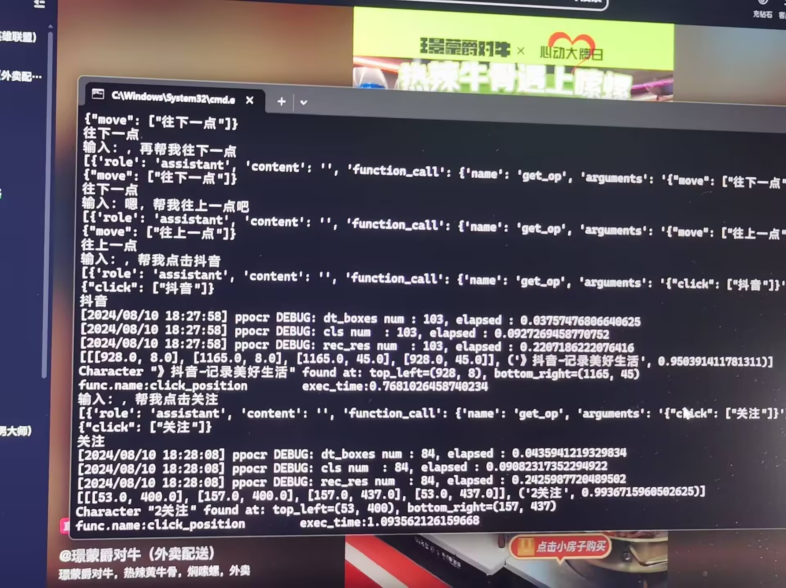

# Image-element-positioning

## 介绍
简单操作电脑的智能体，主要利用ocr检查文本内容的demo

## 使用教程
1. docker搭建funasr环境开启服务
2. python funasr_qwen2_tools.py

## 项目展示

## 说明
    """
        本项利用大模型解读自然语言，实现对电脑的操作，即便在只有cpu的机器上也能快速完成，全本地，可无需联网
        利用的技术与模型：
        1. LLM 使用qwen2      （还推荐使用Gemma2，都是小模型，即便在只有cpu的机器上也能快速完成）
        2. OCR 使用paddle ocr （比EasyOCR快四十倍）
        3. 实时语音识别阿里的FunASR （比谷歌的快，对中文支持较好）
        4. 其他自动化技术不再赘述
        """

        self.get_op = {
            "name": "get_op",
            "description": "获取对哔哩哔哩网页页面的操作",
            "parameters": {
                "type": "object",
                "properties": {
                    "click": {
                        "type": "list",
                        "description": "点击某处，例如：点击番剧"
                    },
                    "watch": {
                        "type": "list",
                        "description": "播放某视频，例如：播放小猪佩奇"
                    },
                    "settings": {
                        "type": "list",
                        "description": "设置某选项为多少，例如：设置音量为20，设置亮度为80"
                    },
                    "move": {
                        "type": "list",
                        "description": "对页面的上下移动，例如：往下一点，往上一点"
                    },
                    "draw": {
                        "type": "list",
                        "description": "勾画某句子,不需要考虑勾画后面的名词是什么意思，例如：框选螃蟹这种格式"
                    },
                    "clean": {
                        "type": "list",
                        "description": "清除,只需要关注这两点，例如：清除"
                    },
                }

            }
        }
